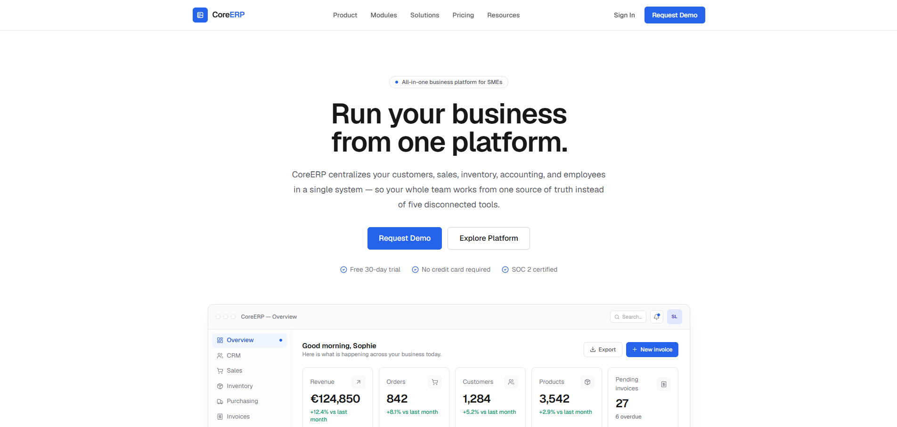

# CoreERP — Landing page



Landing page professionnelle et responsive pour **CoreERP**, une plateforme de gestion d'entreprise (ERP) tout-en-un destinée aux PME.

Le site présente la plateforme de bout en bout : une démo de tableau de bord, les 9 modules métier, des aperçus d'interfaces réalistes (CRM, inventaire, finance, RH, reporting…), les rôles et permissions, les intégrations, la sécurité, les tarifs, une FAQ et un appel à l'action final.

> **[🇬🇧 English version](/README.en.md)**

## Description du projet

CoreERP centralise les opérations d'une entreprise — clients, ventes, stock, comptabilité et employés — dans une seule plateforme. Cette landing page met en scène le produit avec des **préviews d'ERP réalistes construites en pur HTML/CSS** (aucune image), dans un style logiciel d'entreprise sobre :

- fonds neutres, bordures fines, cartes simples
- large espacement, grilles structurées
- aucune dégradée, aucune animation superflue

### Sections de la page

1. **Navbar** : liens d'ancrage (Product, Modules, Solutions, Pricing, Resources), menu mobile.
2. **Hero** : *« Run your business from one platform. »* + tableau de bord ERP (revenus €124 850, commandes 842, clients 1 284, produits 3 542, factures en attente 27, graphique de revenus, commandes récentes, alertes stock, factures).
3. **Modules** : 9 modules (CRM, Sales, Inventory, Purchasing, Invoices, Accounting, HR, Projects, Analytics), chacun avec une mini-préview fonctionnelle.
4. **Approfondissements** : CRM (tableau clients), Inventaire (indicateurs de stock faible), workflow commercial (Devis → Commande → Facture → Paiement), Finance (revenus/dépenses, cash-flow), Employés (annuaire RH), Reporting (KPI et graphiques).
5. **Rôles & permissions** : matrice de permissions par équipe.
6. **Intégrations** : Stripe, PayPal, Google Workspace, Microsoft 365, Slack, Webhooks & API.
7. **Sécurité** : chiffrement, permissions, sauvegardes, journaux d'audit.
8. **Tarifs** : Starter / Professional / Enterprise avec bascule mensuel / annuel (−20 %).
9. **FAQ** : accordéon de questions fréquentes.
10. **CTA final** : *« Manage your entire business from one place. »*
11. **Footer** : liens, mentions légales, réseaux sociaux.

## Stack technique

| Technologie | Rôle |
| --- | --- |
| [Next.js 16](https://nextjs.org) (App Router) | Framework React, rendu serveur, statique |
| TypeScript | Typage statique |
| Tailwind CSS v4 | Styles utilitaires |
| lucide-react | Icônes |
| framer-motion | Animations d'apparition au scroll (minimales) |

> ⚠️ Ce projet utilise **Next.js 16**, qui comporte des changements de compatibilité : Node.js **20.9 ou plus récent** requis. Consultez la documentation incluse dans `node_modules/next/dist/docs/` avant toute modification.

## Prérequis

- **Node.js ≥ 20.9** ([télécharger](https://nodejs.org))
- npm (fourni avec Node) — ou pnpm, déclaré comme gestionnaire dans `package.json`

Vérifiez votre version :

```bash
node --version
```

## Installation

```bash
# 1. Cloner le dépôt
git clone <url-du-dépôt> core-erp
cd core-erp

# 2. Installer les dépendances
npm install

# 3. Lancer le serveur de développement
npm run dev
```

Ouvrez ensuite **http://localhost:3000** dans votre navigateur.

> Si le port 3000 est déjà utilisé, Next.js choisit automatiquement un autre port (ex. 3002) et l'affiche dans la console.

## Utilisation

### Serveur de développement

```bash
npm run dev
```

- Compilation à chaud (Turbopack) : les modifications sont appliquées instantanément.
- Le site est **entièrement statique** (rendu côté serveur) : la page d'accueil est pré-générée à la compilation.

### Build de production

```bash
npm run build
```

Compile l'application, vérifie les types TypeScript et pré-génère les pages statiques.

### Démarrage en production

```bash
npm start
```

Sert le build de production sur **http://localhost:3000**.

### Linting

```bash
npm run lint
```

Exécute ESLint (configuration flat config). `next lint` n'existe plus dans Next.js 16 — la commande `lint` appelle directement ESLint.

## Structure du projet

```
core-erp/
├── app/
│   ├── globals.css        # Thème Tailwind v4, design tokens, styles de base
│   ├── layout.tsx         # Layout racine (polices, métadonnées)
│   └── page.tsx           # Assemblage de toutes les sections
├── components/
│   ├── ui/                # Primitives : boutons, badges, tableaux, graphiques,
│   │                      # cartes KPI, fenêtres (window), conteneurs…
│   ├── previews/          # Préviews d'interfaces ERP (dashboard, CRM, inventaire…)
│   └── sections/          # Sections de la landing page (hero, tarifs, FAQ…)
├── lib/utils.ts           # Helper `cn` (fusion de classes)
└── public/                # Favicon et SVG par défaut
```

### Points d'entrée principaux

| Fichier | Rôle |
| --- | --- |
| `app/page.tsx` | Ordre des sections de la page |
| `app/layout.tsx` | Polices Geist, métadonnées, balise `<html>` |
| `app/globals.css` | Couleurs `brand`, tableau responsive → cartes mobiles |
| `components/sections/*` | Chaque bloc de la landing page |
| `components/previews/*` | Les maquettes d'interface du produit |
| `components/ui/charts.tsx` | Graphiques SVG/HTML maison (ligne, barres, donut, sparkline) |

## Personnalisation

- **Couleur principale** : modifiez la palette `--color-brand-*` dans `app/globals.css`.
- **Contenus** : les données de démonstration (clients, produits, commandes…) sont des constantes typées en haut de chaque fichier `components/previews/*` et `components/sections/*`.
- **Tarifs & FAQ** : à éditer dans `components/sections/pricing.tsx` et `components/sections/faq.tsx`.

## Scripts disponibles

| Commande | Description |
| --- | --- |
| `npm run dev` | Serveur de développement avec rechargement à chaud |
| `npm run build` | Build de production (typecheck + pré-génération statique) |
| `npm start` | Serveur de production |
| `npm run lint` | Vérification ESLint |
